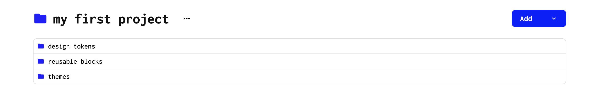
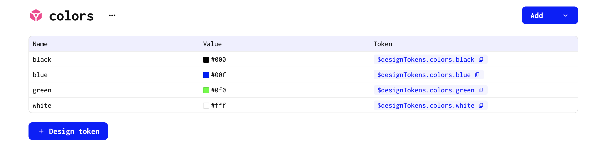
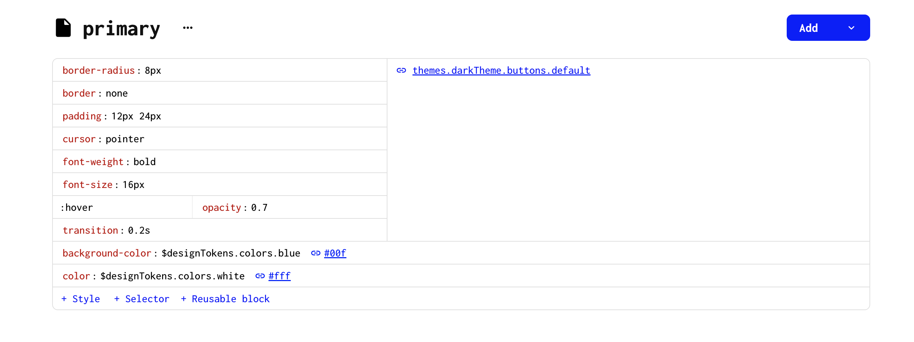
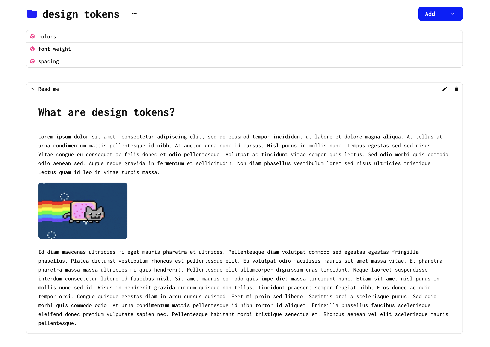

# Welcome to Gouache 👋🏽

Welcome to the [Gouache app](https://gouache.app/) documentation. 

In this documentation, you'll find first how to use the [Gouache platform](https://gouache.app/) and after how to use our [React hook](https://github.com/gouache-app/use-gouache).

## Before you start

Before you start, let's understand what compose a Gouache project. A project can contains 4 file types:

1. [Folder](#folder)
2. [Design tokens folder](#design-tokens-file)
3. [Style Sheet](##style-sheet)
4. [Read me](#read-me)

 

### Folder

A folder can store any other type of data. You can think of a folder the same way they exists in your computer. A design can then contains Design Tokens folder, Style Sheets and other Folders too.

 

### Design tokens folder

A Design Tokens folder contains design tokens. For instance, a you could create a design tokens folder named `colors` that would store all the colors for your app:

 

### Style Sheet

A Style Sheet is a document that store styles values. Inside this file, you can store css styles, use design tokens as style variable or import an existing style sheet as a reusable block.

In the example above, to style our primary button, we're using the `default button` reusable block and we're adding a `blue` background-color and a `white` color (both stored as Design Tokens).

### Adding a design token inside a Style Sheet

It's pretty easy to reuse a design token inside a style sheet. Simply type the a `$` with the name of the design token.

 

<iframe width="560" height="315" src="https://www.youtube.com/embed/sNsuS5wHBUM" title="YouTube video player" frameborder="0" allow="accelerometer; autoplay; clipboard-write; encrypted-media; gyroscope; picture-in-picture" allowfullscreen></iframe>

 

### Read me 

A Read me file can be added to any file style (Folder, Design Tokens folder, Style Sheet). This allow you to add documentation that helps your team understand your structure. 

Gouache provides a simple way to add documentation to your Folders, Design Tokens, and Style Sheets. Here you can add anything you want using the Markdown markup language.

