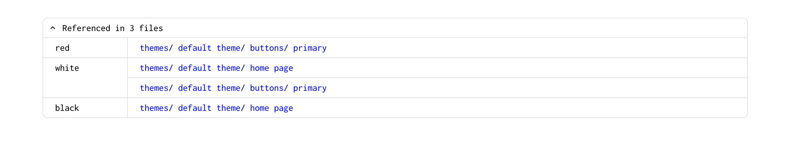

# Create a Design Tokens Folder

Adding a [Design Tokens file](/docs/intro#design-tokens-file) is pretty similar than adding a Folder. You need to click on the top right `Add` button anc dlick on `Design Tokens`. You'll then need to add a name for the New design tokens folder. 

 

<iframe width="560" height="215" src="https://www.youtube.com/embed/gc_MDPFVUoo" title="YouTube video player" frameborder="0" allow="accelerometer; autoplay; clipboard-write; encrypted-media; gyroscope; picture-in-picture" allowfullscreen></iframe>

 

### Adding a Design Token

To add a Design Token, you need to click on the `+ Design token` button. You'll then be asked to give it a name and a value. For instance, the name of the desing token could be `blue` and the value could be `#0000ff`. 

 
<iframe width="560" height="215" src="https://www.youtube.com/embed/nJ-Sy4hBen0" title="YouTube video player" frameborder="0" allow="accelerometer; autoplay; clipboard-write; encrypted-media; gyroscope; picture-in-picture" allowfullscreen></iframe>
 
 

Another thing you'll see is the `Autogenerated Token`. This is used to use the newly created design token as a reference in your style sheets. This way, you'll be able to modify your design token and value and name and their reference will update automagically.

 

<iframe width="560" height="325" src="https://www.youtube.com/embed/OcEOl_4k5jA" title="YouTube video player" frameborder="0" allow="accelerometer; autoplay; clipboard-write; encrypted-media; gyroscope; picture-in-picture" allowfullscreen></iframe>

 

### Edit a Design Token

Editing a design token value or name is pretty easy. You only hover over the design token you want to edit and to click on the `edit` button.

 
<iframe width="560" height="215" src="https://www.youtube.com/embed/uS14_mBEJg4" title="YouTube video player" frameborder="0" allow="accelerometer; autoplay; clipboard-write; encrypted-media; gyroscope; picture-in-picture" allowfullscreen></iframe>
 

### Delete a Design Token

Deleting a Design Token is pretty similar than editing one. Hover over the design token you want to edit and to click on the `delete` button.

 In order to delete a design token, you need to first remove where it is referenced inside the [Styles sheets](/docs/intro#style-sheet). If you're not using the design tokens in your Styles sheets, you'll be able to delete it right away.

### Referenced in

You can see where each design tokens are being as reference used inside your project below the `+ Design tokens` button.

